## ScratchPad
It is used to keep track of your day-to-day expenses, calculate and keep records of monthly expenditure and lots more. In the backend it uses SQLite database to store data the same way as WhatsApp uses to store their user chats. Do make sure to try this one out if you are viewing the code.
***Following are the features implemented***

 - A suitable icon for a suitable app 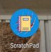
 - A very strain free UI to let u work long without straining ur eyes 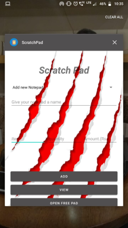
 - Create a scratch pad to store ur monthly bills and budget plannings 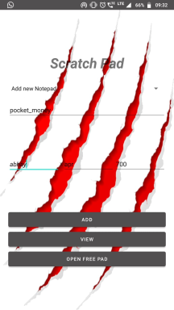 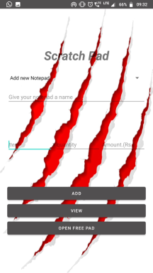 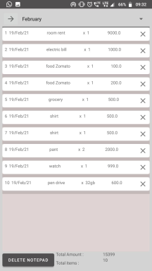
 - filter feature to filter ur budget separately and get total amount and total items 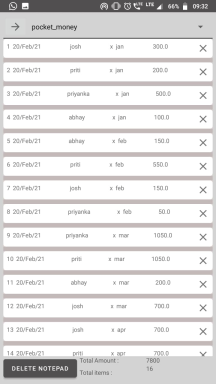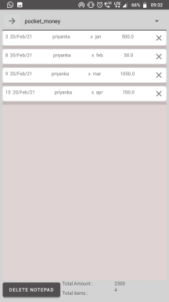 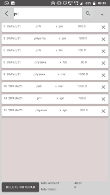
 - Delete table entries now very easily by just clicking a simple cross mark provided after every row 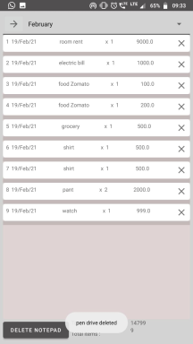
 - navigate through the list of scratch pads u hv with u and maintain them with ease 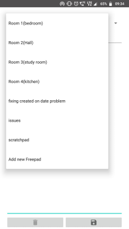
 - Make an instant note by using the free pad feature which stores ur data with a name and date of creation and modification which will help u remember stuffs easily
 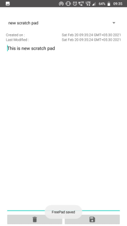 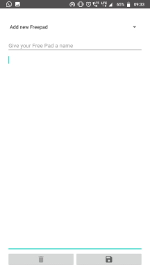 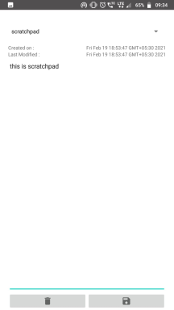
 - modifying, deleting and freeing up ur memory and managing free pads hv now been made easier thn ever befor
 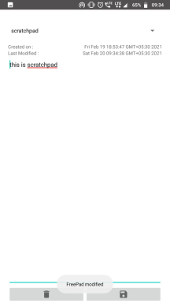 
 - Make sure to explore more n more on this app to see more n more features tht will amaze u
 
######  Hope u will like it... ;D
######  Happy Coding b^.^d
